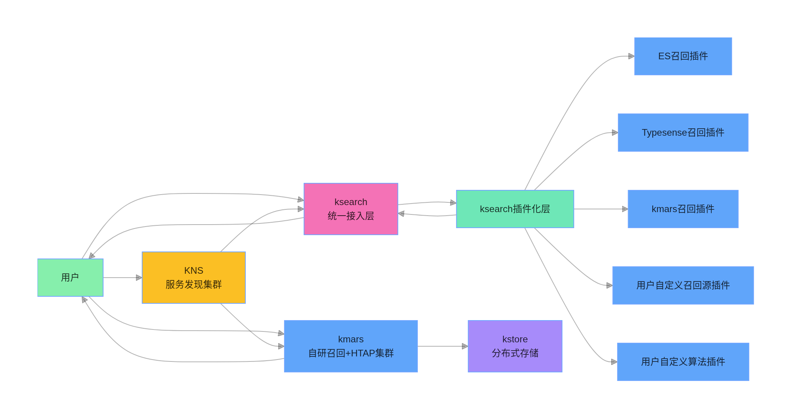

<!--
  Auto-generated by kmpkg tools
  --------------------------------
  This section/template was generated by kmpkg for reference.
  You may modify it freely to suit your project needs.
  Recommended to keep the structure for consistency across projects.
  version: 0.6.0
  date: 2026-03-11
-->

ksearch
=============================

[中文版](./README_CN.md)

<!--
graph LR
    %% 简化样式：仅保留背景色，删除CLion不兼容的rounded/font-weight/stroke-width
    classDef user fill:#86efac
    classDef core fill:#f472b6
    classDef plugin fill:#6ee7b7
    classDef recall fill:#60a5fa
    classDef discovery fill:#fbbf24
    classDef storage fill:#a78bfa
    
    %% 节点文本：删除冗余空格，用双引号包裹（CLion强制要求）
    A["用户"]:::user --> B["ksearch<br/>统一接入层"]:::core 
    A --> H["kmars<br/>自研召回+HTAP集群"]:::recall 
    A --> J["KNS<br/>服务发现集群"]:::discovery 
    B --> C["ksearch插件化层"]:::plugin 
    C --> D["ES召回插件"]:::recall 
    C --> E["Typesense召回插件"]:::recall 
    C --> F["kmars召回插件"]:::recall 
    C --> G1["用户自定义召回源插件"]:::recall 
    C --> G2["用户自定义算法插件"]:::recall 
    J --> B 
    J --> H 
    H --> I["kstore<br/>分布式存储"]:::storage 
    
    %% 拆分链式连接，避免CLion解析异常
    C --> B 
    B --> A 
    H --> A
-->

ksearch Project Description



## 🛠️ Build

This project uses [kmpkg](https://github.com/kumose/kmpkgcore) for dependency management and build integration.
`kmpkg` automatically handles third-party library downloads, dependency resolution, and compiler flag configuration, avoiding the need to manually maintain complex CMake settings.


### 0. Prepare the environment

- Linux (Ubuntu 20.04+ / CentOS 7+ Recommended)
- CMake >= 3.20
- GCC >= 9.4 / Clang >= 12
- Make sure `kmpkg` is installed correctly, documents see [installation guide](https://kumo-pub.github.io/docs/category/%E6%8C%81%E7%BB%AD%E9%9B%86%E6%88%90----kmpkg)

### 1.Configure the project (optional)

* For the complete dependencies, refer to [`kmpkg.json`](kmpkg.json)
* To update the dependency baseline, modify the `baseline` in `default-registry` of [`kmpkg-configuration.json`](kmpkg-configuration.json)
* the `baseline` can be obtained via `git log`.


### 2. Build the project

Run in the project root directory:

```bash
cmake --preset=defualt
cmake --build build -j$(nproc)
```
#### Using Manual Dependency Management

If you manage dependencies yourself, you can build the project
with standard CMake commands:

```shell
mkdir build
cd build
cmake ..
make -j$(nproc)
```

**Note**

- `--preset=default` requires that the corresponding CMake preset is defined in the project root directory.
- When managing dependencies manually, make sure CMake’s find_package can locate all required libraries.

### 3. Run Tests (Optional)

Run in the project root directory:

```shell
ctest --test-dir build
```
