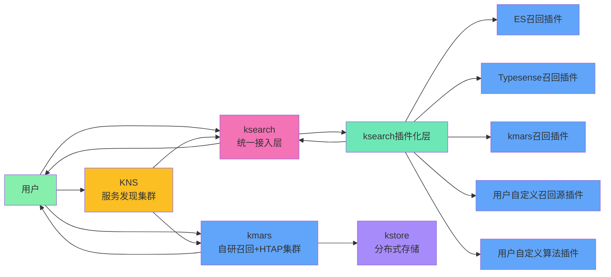

```mermaid
    graph LR
        %% 简化样式：仅保留背景色，删除CLion不兼容的rounded/font-weight/stroke-width
        classDef user fill:#86efac
        classDef core fill:#f472b6
        classDef plugin fill:#6ee7b7
        classDef recall fill:#60a5fa
        classDef discovery fill:#fbbf24
        classDef storage fill:#a78bfa
        
        %% 节点文本：删除冗余空格，用双引号包裹（CLion强制要求）
        A["用户"]:::user --> B["ksearch<br/>统一接入层"]:::core 
        A --> H["kmars<br/>自研召回+HTAP集群"]:::recall 
        A --> J["KNS<br/>服务发现集群"]:::discovery 
        B --> C["ksearch插件化层"]:::plugin 
        C --> D["ES召回插件"]:::recall 
        C --> E["Typesense召回插件"]:::recall 
        C --> F["kmars召回插件"]:::recall 
        C --> G1["用户自定义召回源插件"]:::recall 
        C --> G2["用户自定义算法插件"]:::recall 
        J --> B 
        J --> H 
        H --> I["kstore<br/>分布式存储"]:::storage 
        
        %% 拆分链式连接，避免CLion解析异常
        C --> B 
        B --> A 
        H --> A
```